<p align="center">
  
</p>

# opinionate

Structured peer deliberation for AI coding tools. Get a second opinion from Codex before committing to a plan, review, or architectural decision.

`opinionate` runs a structured deliberation between your primary coding agent (Claude) and a peer agent (Codex CLI), producing a recommendation with full transparency into the reasoning process.

## Quick Start

```bash
# Install the package and Codex CLI
npm install opinionate
npm install -g @openai/codex

# Install the Claude Code skill into your project.
# This writes .claude/skills/opinionate/SKILL.md
npx opinionate install

# Verify the environment before your first run
npx opinionate doctor

# Run a deliberation manually with visibility enabled
npx opinionate run \
  --mode plan \
  --task "Design the authentication system for our API" \
  --cwd . \
  --files "src/auth.ts,src/middleware.ts" \
  --git-log \
  --verbose \
  --show-peer-command
```

## Prerequisites

- Node.js >= 18
- [Codex CLI](https://github.com/openai/codex) installed globally (`npm install -g @openai/codex`)
- Codex authenticated for non-interactive use (`codex login`) or otherwise configured to run `codex exec`

## How It Works

```
┌──────────┐                              ┌──────────┐
│          │  1. task + context            │          │
│  Claude  │ ───────────────────────────►  │ opinion- │
│  (host)  │                               │ ate      │
│          │  4. DeliberationResult (JSON)  │          │
│          │ ◄───────────────────────────   │          │
└──────────┘                               └─────┬────┘
                                                  │
                              2. orchestrator      │     3. peer
                                 prompt            │     response
                                                  ▼
                                           ┌──────────┐
                                           │  Codex   │
                                           │  CLI     │
                                           └──────────┘
```

1. Claude invokes `opinionate run` via the installed skill
2. The engine sends structured prompts to the peer agent (Codex)
3. Codex responds with its analysis
4. The engine evaluates agreement, iterates if needed, and returns a result
5. Claude presents the outcome for your approval

## Usage

### With Claude Code (Recommended)

After running `npx opinionate install`, the skill is available automatically. Claude will invoke it when facing complex decisions, or you can trigger it manually:

```
/opinionate
```

### CLI Reference

```
opinionate run [options]
opinionate doctor [options]
opinionate install
```

#### `run` Options

| Flag | Description | Default |
|------|-------------|---------|
| `--mode` | Deliberation mode: `plan`, `review`, `debug`, `decide` | *required* |
| `--task` | What to deliberate on (1-2 sentences) | *required* |
| `--cwd` | Working directory | `.` |
| `--files` | Comma-separated file paths to include as context | — |
| `--git-log` | Include last 20 commits as context | `false` |
| `--conversation-summary` | Summary of current conversation | — |
| `--max-rounds` | Maximum deliberation rounds | `5` |
| `--timeout` | Per-round timeout in milliseconds | `60000` |
| `--context-budget` | Max context payload size in bytes | `50000` |
| `--peer-adapter` | Peer adapter name | `codex-cli` |
| `--orchestrator-adapter` | Orchestrator adapter name (omit for templates) | — |
| `--model` | Explicit Codex model override | Codex default |
| `--codex-bin` | Codex binary path | `codex` |
| `--verbose` | Print execution lifecycle details to stderr | `false` |
| `--trace-dir` | Directory for per-round JSON artifacts | — |
| `--show-peer-command` | Print the exact Codex argv | `false` |
| `--show-peer-output` | Stream Codex stdout/stderr to stderr | `false` |

#### `doctor`

`opinionate doctor` checks:

- whether the Codex binary is installed
- whether the installed Codex supports `exec`
- whether Codex is authenticated enough to run non-interactively
- whether your chosen model is available to the current Codex account
- whether the Claude project skill exists at `.claude/skills/opinionate/SKILL.md`
- whether the `opinionate` binary is discoverable on the machine

#### Output

- **stdout**: JSON `DeliberationResult` object
- **stderr**: Progress logs and errors

## Model Resolution

Model selection is explicit and predictable:

1. `--model <name>` wins.
2. `OPINIONATE_MODEL` is the fallback (deprecated: `AGENT_DELIBERATE_MODEL` is also accepted).
3. If neither is set, `opinionate` does not inject a model flag and Codex uses its own configured default.

Use `opinionate doctor` to see which source will be used for the current run.

## Inspecting Codex Execution

When you want to see what Codex actually did:

```bash
npx opinionate run \
  --mode review \
  --task "Review this PR" \
  --cwd . \
  --verbose \
  --show-peer-command \
  --trace-dir .opinionate/runs/latest
```

- `--verbose` prints round lifecycle, detected Codex version, and model source to stderr.
- `--show-peer-command` prints the exact Codex command line.
- `--show-peer-output` streams Codex stdout/stderr to stderr.
- `--trace-dir` writes `round-<n>.json` artifacts with stdout, stderr, exit code, signal, duration, and command metadata.

`stdout` stays reserved for the final JSON result.

## Local Development

For local package development:

```bash
pnpm install
pnpm build
pnpm test
npm link
```

Then inside another project:

```bash
cd /path/to/other-project
opinionate install
opinionate doctor
```

If you prefer not to link globally:

```bash
cd /path/to/other-project
node /path/to/opinionate/dist/src/cli.js install
node /path/to/opinionate/dist/src/cli.js doctor
```

## Testing In Another Project

1. Build this repo: `pnpm build`
2. Install or link the binary.
3. Install the project skill into the target repo.
4. Restart Claude Code in that target repo.
5. Run `opinionate doctor --cwd /path/to/project`
6. Run a visible dry run with `--verbose --show-peer-command`

The project skill should end up at `.claude/skills/opinionate/SKILL.md`.

## Troubleshooting

### Codex not installed

Run:

```bash
npm install -g @openai/codex
opinionate doctor
```

### Codex installed but not authenticated

If `doctor` reports an auth problem, run:

```bash
codex login
opinionate doctor
```

### Model/account mismatch

If `doctor --model <name>` reports that the model is unavailable to your account, either:

- remove `--model` and let Codex use its default
- choose a model your Codex account supports
- update your Codex account/config and rerun `opinionate doctor`

### Skill not visible in Claude

Confirm the file exists at:

```bash
.claude/skills/opinionate/SKILL.md
```

Then restart the Claude Code session and rerun `opinionate doctor`.

### Modes

| Mode | Use When |
|------|----------|
| **plan** | Before implementation — explore approaches, architecture, trade-offs |
| **review** | After writing code — get a second opinion on correctness and quality |
| **debug** | When stuck — brainstorm hypotheses and debugging strategies |
| **decide** | Facing a choice — weigh options for libraries, patterns, API design |

## Library API

Use `opinionate` programmatically in your own tools:

```typescript
import { Deliberation, CodexCliAdapter } from 'opinionate';

const result = await new Deliberation({
  mode: 'plan',
  peerAdapter: new CodexCliAdapter({ timeout: 60_000 }),
  context: {
    task: 'Design the caching layer',
    files: [{ path: 'src/cache.ts', content: '...' }],
    cwd: '/path/to/project',
  },
  maxRounds: 5,
  timeout: 60_000,
  contextBudget: 50_000,
  onRoundComplete: (round, transcript) => {
    console.error(`Round ${round} complete`);
  },
}).run();

if (result.agreed) {
  console.log('Decision:', result.decision);
} else {
  console.log('Recommended path:', result.recommendedPath);
  console.log('Peer position:', result.peerPosition);
  console.log('Disagreements:', result.keyDisagreements);
}
```

## Writing a Custom Adapter

Implement the `Adapter` interface to add support for any LLM:

```typescript
import type { Adapter, DeliberationContext } from 'opinionate';

class MyAdapter implements Adapter {
  name = 'my-adapter';

  async initialize(): Promise<void> {
    // Validate credentials, warm up connections
  }

  async isAvailable(): Promise<boolean> {
    // Return true if the adapter can be used
    return true;
  }

  async sendMessage(prompt: string, context: DeliberationContext): Promise<string> {
    // Send the prompt to your LLM and return its response
    const response = await myLlmClient.complete(prompt);
    return response.text;
  }

  async cleanup(): Promise<void> {
    // Release resources
  }
}
```

Then use it:

```typescript
const result = await new Deliberation({
  mode: 'plan',
  peerAdapter: new MyAdapter(),
  // or as orchestrator:
  // orchestratorAdapter: new MyAdapter(),
  // peerAdapter: new CodexCliAdapter(),
  ...
}).run();
```

## Context Safety

Before sending files to the peer agent, `opinionate` filters out sensitive files:

**Excluded by default:** `.env`, `.env.*`, `*.pem`, `*.key`, `*.p12`, `*.pfx`, and files containing `credential` or `secret` in their path.

**Custom exclusions:** Create a `.opinionateignore` file in your project root (same syntax as `.gitignore`):

```gitignore
# .opinionateignore
config/production.yaml
internal/keys/
*.token
```

> **Note:** `.deliberateignore` is still supported for backwards compatibility but is deprecated. Rename it to `.opinionateignore`.

> **Note:** Filtering is filename-pattern-based only. It does not scan file contents for embedded secrets. If you have hardcoded keys in source files, add those paths to `.opinionateignore`.

## Architecture

```
src/
├── core/
│   ├── types.ts              # Interfaces, error types, defaults
│   ├── deliberation.ts       # Main loop engine
│   ├── context-builder.ts    # Context budgeting + safety filtering
│   ├── agreement-detector.ts # Heuristic convergence detection
│   ├── preflight.ts          # doctor command logic
│   ├── runtime-config.ts     # CLI/env resolution
│   └── execution-trace.ts    # verbose/trace artifacts
├── adapters/
│   ├── adapter.ts            # Adapter interface re-export
│   └── codex-cli.ts          # Codex CLI adapter
├── cli.ts                    # CLI entrypoint
├── install.ts                # Skill installer
├── util/
│   ├── codex-cli-info.ts     # Codex capability/auth probing
│   └── claude-skill-paths.ts # Claude skill path helpers
└── index.ts                  # Public API
```

## Contributing

Contributions welcome. The most impactful areas:

- **New adapters** — Gemini, local models (Ollama), Claude API
- **Agreement detection** — Better heuristics or optional LLM-as-judge mode
- **Context building** — Smarter file relevance ranking, content-based secret scanning

## License

MIT
